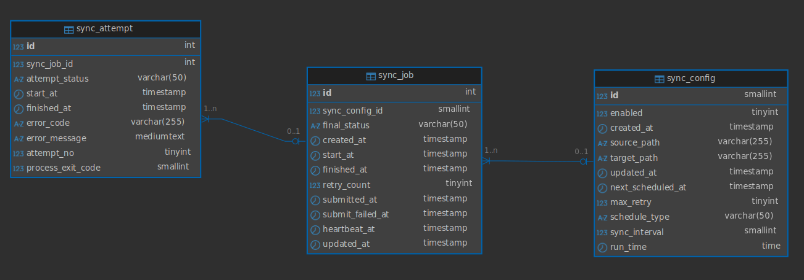
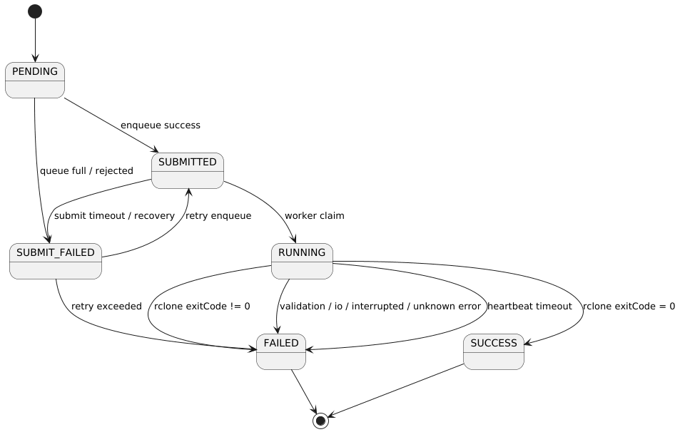
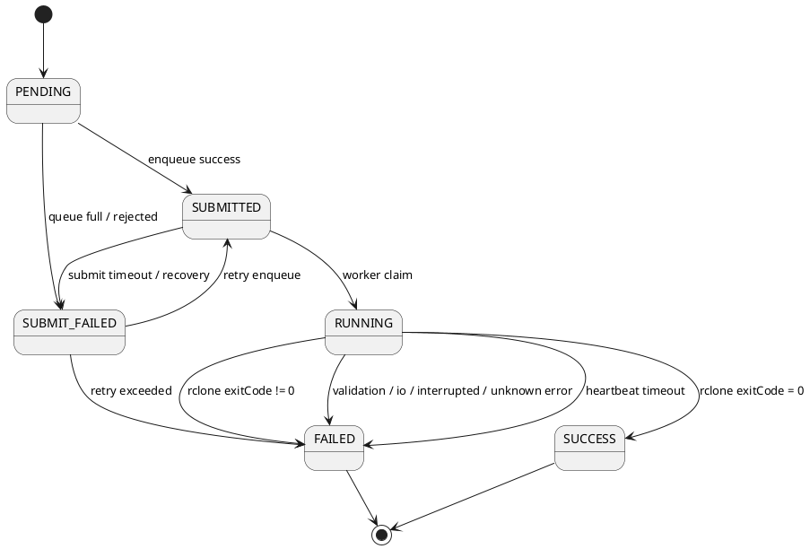

# Personal Cloud Sync - Low Level Design

## 1. Overview

Personal Cloud Sync là hệ thống đồng bộ thư mục local lên cloud bằng `rclone`.

Mục tiêu chính:

- Tạo cấu hình đồng bộ lâu dài.
- Chạy đồng bộ thủ công hoặc theo lịch.
- Mỗi lần đồng bộ được biểu diễn bằng một `sync_job`.
- Ghi nhận kết quả thực thi, lỗi, exit code và log xử lý.
- Hỗ trợ retry, recovery và observability ở các phase sau.

---

## 2. Core Domain Concepts

### 2.1 Sync Config

`sync_config` đại diện cho một cấu hình đồng bộ lâu dài.

Ví dụ:

```text
sourcePath = /home/user/data
targetPath = /mnt/onedrive/backup
scheduleType = MANUAL
enabled = true
```

Một `sync_config` có thể sinh ra nhiều `sync_job`.

Ví dụ:

```text
sync_config #1
├── sync_job #101 MANUAL FAILED
├── sync_job #102 MANUAL SUCCESS
└── sync_job #103 SCHEDULED SUCCESS
```

### 2.2 Sync Job

`sync_job` đại diện cho một lần chạy cụ thể của một `sync_config`.

Một job có thể được tạo bởi:

- User gọi API chạy thủ công.
- Scheduler tạo job theo lịch.

Các thông tin chính của `sync_job`:

```text
id
sync_config_id
final_status
retry_count
created_at
submitted_at
submit_failed_at
start_at
heartbeat_at
finished_at
```

### 2.3 Sync Attempt

`sync_attempt` đại diện cho một lần thực thi thực tế của job.

Nếu job có retry, một `sync_job` có thể có nhiều `sync_attempt`.

Ví dụ:

```text
sync_job #100
├── sync_attempt #103 FAILED RCLONE_ERROR
└── sync_attempt #104 SUCCESS
```

Trong Phase 1, nếu chưa triển khai retry đầy đủ, có thể coi mỗi `sync_job` có tối đa một `sync_attempt`.

---

## 3. State Machine

### 3.1 Job Status


```text
PENDING
SUBMITTED
SUBMIT_FAILED
RUNNING
SUCCESS
FAILED
```

Ý nghĩa:

| Status | Meaning |
|---|---|
| PENDING | Job đã được tạo trong DB nhưng chưa submit vào executor/queue |
| SUBMITTED | Job đã được submit vào executor/queue |
| SUBMIT_FAILED | Submit thất bại, ví dụ queue full hoặc executor reject |
| RUNNING | Worker đã claim job và đang chạy rclone |
| SUCCESS | Job hoàn thành thành công |
| FAILED | Job thất bại và không còn được xử lý tiếp |

### 3.2 State Transition



### 3.3 Active Job Definition

Một `sync_config` chỉ được có tối đa một active job tại một thời điểm.

Active statuses:

```text
PENDING
SUBMITTED
SUBMIT_FAILED
RUNNING
```

`SUBMIT_FAILED` vẫn được xem là active nếu còn khả năng retry.

Nếu retry exceeded, job chuyển sang `FAILED` và không còn active.

---

## 4. API Design

## 4.1 Create Sync Config

```http
POST /sync-config
```

### Request

```json
{
  "sourcePath": "/home/user/data",
  "targetPath": "/mnt/backup/data",
  "scheduleType": "MANUAL",
  "enabled": true,
  "scheduleInterval": null,
  "runTime": null
}
```

### Response - 201 Created

```json
{
  "id": 1
}
```

### Error Cases

#### Sync config already exists

```http
400 Bad Request
```

```json
{
  "message": "Sync config already exists"
}
```

#### Path is blank

```http
400 Bad Request
```

```json
{
  "message": "Source path or target path should not be blank"
}
```

#### Path is invalid

```http
400 Bad Request
```

```json
{
  "message": "Source path or target path is invalid"
}
```

---

## 4.2 List Sync Configs

```http
GET /sync-config
```

### Response - 200 OK

```json
[
  {
    "id": 1,
    "sourcePath": "/home/user/data",
    "targetPath": "/mnt/backup/data",
    "scheduleType": "MANUAL",
    "enabled": true
  }
]
```

---

## 4.3 Enable Sync Config

```http
PATCH /sync-config/{id}/enable
```

### Response - 200 OK

```json
{
  "id": 1,
  "enabled": true
}
```

### Error Cases

#### Sync config not found

```http
404 Not Found
```

```json
{
  "message": "Sync config not found"
}
```

#### Sync config already enabled

```http
400 Bad Request
```

```json
{
  "message": "Sync config is already enabled"
}
```

---

## 4.4 Disable Sync Config

```http
PATCH /sync-config/{id}/disable
```

### Response - 200 OK

```json
{
  "id": 1,
  "enabled": false
}
```

### Error Cases

#### Sync config not found

```http
404 Not Found
```

```json
{
  "message": "Sync config not found"
}
```

#### Sync config already disabled

```http
400 Bad Request
```

```json
{
  "message": "Sync config is already disabled"
}
```

---

## 4.5 Run Manual Sync Job

```http
POST /sync-config/{id}/sync-jobs/manual
```

API này dùng để chạy sync thủ công từ một `sync_config` đã tồn tại.

API không tạo lại `sync_config`.

API tạo một `sync_job` mới với:

```text
triggerType = MANUAL
status = PENDING
```

### Request

Không cần body.

```json
{}
```

### Success Flow

```text
User gọi API run manual sync
→ hệ thống kiểm tra sync_config tồn tại
→ hệ thống kiểm tra sync_config đang enabled
→ hệ thống kiểm tra sourcePath / targetPath vẫn hợp lệ
→ hệ thống kiểm tra không có active job của config này
→ tạo sync_job với status = PENDING
→ submit sync_job_id vào ExecutorService
→ nếu submit thành công: update status PENDING -> SUBMITTED
→ API trả về syncJobId
→ worker xử lý sync_job bất đồng bộ
```

### Response - 202 Accepted

```json
{
  "syncJobId": 100,
  "syncConfigId": 1,
  "status": "SUBMITTED",
  "triggerType": "MANUAL"
}
```

Dùng `202 Accepted` vì request đã được nhận, job đã được tạo và submit, nhưng quá trình sync chạy bất đồng bộ và chưa hoàn thành ngay.

### Error Cases

#### Sync config not found

```http
404 Not Found
```

```json
{
  "message": "Sync config not found"
}
```

#### Sync config is disabled

```http
400 Bad Request
```

```json
{
  "message": "Cannot run manual sync because sync config is disabled"
}
```

#### Sync job already active

```http
409 Conflict
```

```json
{
  "message": "Sync config already has an active job"
}
```

#### Source path or target path invalid

```http
400 Bad Request
```

```json
{
  "message": "Source path or target path is invalid"
}
```

---

## 4.6 Get Sync Job Detail

```http
GET /sync-jobs/{id}
```

### Response - 200 OK

```json
{
  "id": 100,
  "syncConfigId": 1,
  "triggerType": "MANUAL",
  "status": "SUCCESS",
  "startedAt": "2026-06-10T10:00:00",
  "finishedAt": "2026-06-10T10:00:15",
  "exitCode": 0,
  "errorCode": null,
  "errorMessage": null
}
```

### Error Cases

#### Sync job not found

```http
404 Not Found
```

```json
{
  "message": "Sync job not found"
}
```

---

## 5. Validation Rules

Validation nên được xử lý ở tầng service/domain validation, không chỉ dựa vào database constraint.

---

## 5.1 Create Sync Config Validation

### sourcePath

```text
- must not be null
- must not be blank
- must not exceed 255 characters
- must be absolute Linux path
- path must exist
- path must be directory
```

### targetPath

```text
- must not be null
- must not be blank
- must not exceed 255 characters
- must be absolute Linux path
- path must exist
- path must be directory
```

### scheduleType

```text
- must be one of: MANUAL, INTERVAL, DAILY
- default is MANUAL
```

### enabled

```text
- must not be null
```

---

## 5.2 Path Validation

Path phải là absolute Linux path.

Supported:

```text
/home/user/data
/mnt/backup
```

Not supported:

```text
~/data
./data
../data
```

---

## 5.3 Unique Sync Config

Không cho phép tạo trùng `sync_config` có cùng:

```text
sourcePath
targetPath
scheduleType
```

Database constraint:

```text
unique(source_path, target_path, schedule_type)
```

Nếu đã tồn tại sync config tương ứng, hệ thống trả về `400 Bad Request`.

---

## 5.4 Manual Sync Job Validation

Khi user gọi:

```http
POST /sync-config/{id}/sync-jobs/manual
```

Hệ thống cần validate:

```text
- sync config id must exist
- sync config must be enabled
- source path must still exist
- target path must still exist
- source path must be directory
- target path must be directory
- sync config must not have active job
```

Active statuses:

```text
PENDING
SUBMITTED
SUBMIT_FAILED
RUNNING
```

Nếu đã có active job, không tạo job mới.

```json
{
  "message": "Sync config already has an active job"
}
```

---

## 5.5 Schedule Rule

Scheduler chỉ xử lý các `sync_config` có lịch tự động.

Điều kiện lấy config:

```text
enabled = true
scheduleType != MANUAL
nextScheduledAt <= now()
```

Scheduler sẽ tạo một `sync_job` tương ứng với từng cấu hình đủ điều kiện.

Job được tạo bởi scheduler có:

```text
triggerType = SCHEDULED
status = PENDING
```

---

## 5.6 Schedule Type Rule

### MANUAL

```text
scheduleType = MANUAL
scheduleInterval = null
runTime = null
nextScheduledAt = null
```

### INTERVAL

```text
scheduleType = INTERVAL
scheduleInterval must not be null
scheduleInterval > 0
runTime = null
nextScheduledAt must not be null
```

### DAILY

```text
scheduleType = DAILY
runTime must not be null
scheduleInterval = null
nextScheduledAt must not be null
```

---

## 6. Manual Sync Job Flow

```text
User
→ POST /sync-config/{id}/sync-jobs/manual
→ SyncJobApplicationService validates sync_config
→ SyncJobApplicationService creates sync_job PENDING
→ SyncJobDispatcher submits sync_job_id to ExecutorService
→ Dispatch success: update PENDING -> SUBMITTED
→ API returns sync_job_id
→ Worker thread loads sync_job
→ Worker claims job: SUBMITTED -> RUNNING
→ Worker starts heartbeat
→ RcloneExecutor runs rclone sync
→ Worker updates RUNNING -> SUCCESS or FAILED
→ Worker stops heartbeat
```

---

## 7. Main Components

```text
```

### Responsibility

---

## 8. Manual Sync Job Algorithm

### 8.1 API Layer

```java
public ManualSyncJobResponse runManualSyncJob(Long syncConfigId) {
    SyncJob job = syncJobCommandService.createPendingManualJob(syncConfigId);

    try {
        syncJobDispatcher.dispatch(job.getId());
        syncJobCommandService.markSubmitted(job.getId());
    } catch (RejectedExecutionException e) {
        syncJobCommandService.markSubmitFailed(
            job.getId(),
            SyncErrorCode.QUEUE_FULL,
            "Executor queue is full"
        );
    }

    return ManualSyncJobResponse.from(job.getId(), syncConfigId);
}
```

### 8.2 Create Pending Job

```java
@Transactional
public SyncJob createPendingManualJob(Long syncConfigId) {
    SyncConfig config = syncConfigRepository.findByIdForUpdate(syncConfigId)
        .orElseThrow(() -> new SyncConfigNotFoundException("Sync config not found"));

    if (!config.isEnabled()) {
        throw new SyncConfigDisabledException("Cannot run manual sync because sync config is disabled");
    }

    if (syncJobRepository.existsActiveJob(syncConfigId)) {
        throw new SyncJobAlreadyActiveException("Sync config already has an active job");
    }

    validatePath(config.getSourcePath());
    validatePath(config.getTargetPath());

    SyncJob job = SyncJob.createPendingManualJob(config);

    return syncJobRepository.save(job);
}
```

### 8.3 Processor

```java
public void process(Long syncJobId) {
    ScheduledFuture<?> heartbeatTask = null;

    try {
        SyncJobContext context = syncJobCommandService.markRunning(syncJobId);

        heartbeatTask = heartbeatService.start(syncJobId);

        RcloneResult result = rcloneExecutor.sync(context);

        if (result.isSuccess()) {
            syncJobCommandService.markSuccess(syncJobId, result.exitCode());
            return;
        }

        SyncErrorCode errorCode = syncErrorCodeResolver.resolve(result);

        syncJobCommandService.markFailed(
            syncJobId,
            result.exitCode(),
            errorCode,
            result.stderr()
        );

    } catch (InterruptedException e) {
        Thread.currentThread().interrupt();

        syncJobCommandService.markFailed(
            syncJobId,
            null,
            SyncErrorCode.PROCESS_INTERRUPTED,
            "Sync worker thread was interrupted"
        );

    } catch (IOException e) {
        syncJobCommandService.markFailed(
            syncJobId,
            null,
            SyncErrorCode.PROCESS_EXECUTION_ERROR,
            e.getMessage()
        );

    } catch (Exception e) {
        syncJobCommandService.markFailed(
            syncJobId,
            null,
            SyncErrorCode.UNKNOWN_ERROR,
            e.getMessage()
        );

    } finally {
        if (heartbeatTask != null) {
            heartbeatTask.cancel(false);
        }
    }
}
```

---

## 9. Error Handling Design

Error handling được chia thành 2 nhóm.

### 9.1 API Error

Lỗi xảy ra khi user gọi API.

Ví dụ:

```text
request invalid
sync config not found
sync config disabled
active job already exists
```

Các lỗi này trả về HTTP status tương ứng.

### 9.2 Sync Job Error

Lỗi xảy ra trong quá trình xử lý sync job bất đồng bộ.

Các lỗi này không trả trực tiếp về API caller.

Hệ thống lưu lỗi vào `sync_job` và/hoặc `sync_attempt`.

---

## 10. Sync Error Code

`SyncErrorCode` đại diện cho nguyên nhân thất bại.

`JobStatus.FAILED` chỉ cho biết job đã thất bại.

`SyncErrorCode` cho biết job thất bại vì lý do gì.

```java
public enum SyncErrorCode {
    VALIDATION_ERROR,
    QUEUE_FULL,
    PROCESS_EXECUTION_ERROR,
    PROCESS_INTERRUPTED,
    RCLONE_ERROR,
    NETWORK_ERROR,
    HEARTBEAT_TIMEOUT,
    UNKNOWN_ERROR
}
```

### 10.1 Sync Error Code Meaning

| Error Code | Meaning | Retryable |
|---|---|---|
| VALIDATION_ERROR | Source path / target path invalid before running sync job | NO |
| QUEUE_FULL | Executor queue is full or task rejected | YES |
| PROCESS_EXECUTION_ERROR | IOException occurred while starting process or reading process output | MAYBE |
| PROCESS_INTERRUPTED | Worker thread was interrupted | YES |
| RCLONE_ERROR | rclone exited with non-zero exit code | DEPENDS |
| NETWORK_ERROR | Network-related failure during sync process | YES |
| HEARTBEAT_TIMEOUT | Job stayed RUNNING but heartbeat stopped | DEPENDS |
| UNKNOWN_ERROR | Unexpected exception or unmapped failure | MAYBE |

### 10.2 Exception To SyncErrorCode Mapping

| Case | Exception / Signal | SyncErrorCode | Job Status |
|---|---|---|---|
| Source path does not exist before running job | InvalidPathException | VALIDATION_ERROR | FAILED |
| Target path does not exist before running job | InvalidPathException | VALIDATION_ERROR | FAILED |
| Source path is not directory | LocalPathIsNotDirectoryException | VALIDATION_ERROR | FAILED |
| Target path is not directory | LocalPathIsNotDirectoryException | VALIDATION_ERROR | FAILED |
| Executor queue full | RejectedExecutionException | QUEUE_FULL | SUBMIT_FAILED |
| Failed to start rclone process | IOException from ProcessBuilder.start() | PROCESS_EXECUTION_ERROR | FAILED |
| Failed while reading stdout/stderr | IOException | PROCESS_EXECUTION_ERROR | FAILED |
| Worker thread interrupted | InterruptedException | PROCESS_INTERRUPTED | FAILED |
| rclone exit code != 0 | RcloneResult.isSuccess() == false | RCLONE_ERROR | FAILED |
| Network error detected from stderr | stderr contains network-related message | NETWORK_ERROR | FAILED |
| heartbeat timeout | heartbeatAt older than threshold | HEARTBEAT_TIMEOUT | FAILED |
| Unexpected runtime exception | RuntimeException | UNKNOWN_ERROR | FAILED |

---

## 11. API Error Mapping

| Case | HTTP Status | Exception |
|---|---:|---|
| Request field invalid | 400 Bad Request | ValidationException |
| Request body is null | 400 Bad Request | MethodArgumentNotValidException |
| Path does not exist | 400 Bad Request | InvalidPathException |
| Path is not directory | 400 Bad Request | LocalPathIsNotDirectoryException |
| Source path / target path null | 400 Bad Request | InvalidPathException |
| Source path / target path blank | 400 Bad Request | InvalidPathException |
| Source path / target path too long | 400 Bad Request | InvalidPathException |
| Sync config already exists | 400 Bad Request | DuplicateSyncConfigException |
| Sync config not found | 404 Not Found | SyncConfigNotFoundException |
| Sync config already enabled | 400 Bad Request | SyncConfigAlreadyEnabledException |
| Sync config already disabled | 400 Bad Request | SyncConfigAlreadyDisabledException |
| Sync config disabled when running manual job | 400 Bad Request | SyncConfigDisabledException |
| Sync config already has active job | 409 Conflict | SyncJobAlreadyActiveException |
| Sync job not found | 404 Not Found | SyncJobNotFoundException |
| Job is not in expected state | 409 Conflict | InvalidJobStateTransitionException |
| Maximum retry count exceeded | 400 Bad Request | MaximumRetryCountExceededException |
| Unexpected server error | 500 Internal Server Error | InternalServerException |

---

## 12. Rclone Exit Code Handling

Rclone execution result is represented by `RcloneResult`.

```java
public record RcloneResult(
    int exitCode,
    String stdout,
    String stderr
) {
    public boolean isSuccess() {
        return exitCode == 0;
    }
}
```

### 12.1 Basic Exit Code Rule

| Exit Code | Meaning | Job Status | SyncErrorCode |
|---:|---|---|---|
| 0 | Success | SUCCESS | null |
| non-zero | Rclone failed | FAILED | RCLONE_ERROR or NETWORK_ERROR |

Phase 1 rule:

```text
exitCode = 0  -> SUCCESS
exitCode != 0 -> FAILED + RCLONE_ERROR
```

Optional Phase 2 rule:

```text
if exitCode != 0 and stderr looks like network error
    errorCode = NETWORK_ERROR
else
    errorCode = RCLONE_ERROR
```

### 12.2 Network Error Detection

Example keywords:

```text
connection refused
connection reset
timeout
temporary failure
network is unreachable
no route to host
TLS handshake timeout
```

---

## 13. Failure Persistence Rule

When sync job fails, system must persist:

```text
status
finishedAt
errorCode
errorMessage
processExitCode
```

Example: rclone failed

```text
status = FAILED
errorCode = RCLONE_ERROR
errorMessage = "rclone sync failed"
processExitCode = 1
finishedAt = now()
```

Example: process cannot start

```text
status = FAILED
errorCode = PROCESS_EXECUTION_ERROR
errorMessage = "Failed to start rclone process"
processExitCode = null
finishedAt = now()
```

Example: queue full

```text
status = SUBMIT_FAILED
errorCode = QUEUE_FULL
errorMessage = "Executor queue is full"
processExitCode = null
```

---

## 14. Concurrency Design

### 14.1 Phase 1 Assumption

```text
- System runs with one application instance only.
- Manual sync job is executed by local ExecutorService.
- No distributed lock is required.
- A sync_config cannot have more than one active sync_job.
```

### 14.2 Manual Job Concurrency Rule

Before creating a manual sync job, system must check whether the `sync_config` already has an active job.

Active statuses:

```text
PENDING
SUBMITTED
SUBMIT_FAILED
RUNNING
```

If yes, reject the request with `409 Conflict`.

### 14.3 Database-Level Protection

Service validation is required, but DB-level protection should still exist because concurrent requests may pass validation at the same time.

Recommended approaches:

1. Use pessimistic lock on `sync_config` when creating job.

```sql
select *
from sync_config
where id = ?
for update;
```

2. Or use a generated active flag / partial unique strategy if supported.

For MySQL/MariaDB, locking parent `sync_config` row during job creation is simpler and sufficient for Phase 1.

---

## 15. Scheduler Design

### 15.1 Scheduler Query

Scheduler selects due configs:

```sql
select *
from sync_config
where enabled = true
  and schedule_type <> 'MANUAL'
  and next_scheduled_at <= ?
order by next_scheduled_at asc
limit ?
for update skip locked;
```

### 15.2 Scheduler Flow

```text
Scheduler tick
→ find due sync_configs with FOR UPDATE SKIP LOCKED
→ for each config:
    → check no active job
    → create sync_job PENDING
    → compute nextScheduledAt
    → submit job
    → mark SUBMITTED or SUBMIT_FAILED
```

### 15.3 Required Index

Recommended index:

```sql
create index idx_sync_config_scheduler_due
on sync_config(enabled, schedule_type, next_scheduled_at);
```

If using MySQL and query filters `schedule_type <> 'MANUAL'`, consider measuring with `EXPLAIN ANALYZE` and adjust index order based on cardinality and selectivity.

---

## 16. Recovery Design

### 16.1 Recover SUBMITTED Jobs

Problem:

```text
Job was submitted
Application crashed before worker claimed it
Job remains SUBMITTED forever
```

Recovery rule:

```text
if status = SUBMITTED
and submittedAt < now - submittedTimeout
then mark SUBMIT_FAILED
```

Alternative:

```text
SUBMITTED -> PENDING
```

Current chosen design:

```text
SUBMITTED -> SUBMIT_FAILED
```

because submit did not lead to actual processing.

### 16.2 Recover RUNNING Jobs

Problem:

```text
Worker marked job RUNNING
Application crashed
heartbeatAt stopped updating
Job remains RUNNING forever
```

Recovery rule:

```text
if status = RUNNING
and heartbeatAt < now - heartbeatTimeout
then mark FAILED with HEARTBEAT_TIMEOUT
```

### 16.3 Retry SUBMIT_FAILED Jobs

```text
if status = SUBMIT_FAILED
and retryCount < maxRetry
then retry enqueue
else mark FAILED
```

---

## 17. Logging Strategy

### 17.1 Job Start

```text
event=SYNC_JOB_STARTED syncConfigId=1 syncJobId=100 triggerType=MANUAL status=RUNNING
```

### 17.2 Job Finish

```text
event=SYNC_JOB_FINISHED syncConfigId=1 syncJobId=100 triggerType=MANUAL status=SUCCESS durationMs=15000 exitCode=0
```

### 17.3 Job Failed

```text
event=SYNC_JOB_FAILED syncConfigId=1 syncJobId=100 triggerType=MANUAL status=FAILED exitCode=1 errorCode=RCLONE_ERROR errorMessage="rclone sync failed"
```

### 17.4 MDC Fields

Recommended MDC fields:

```text
requestId
jobTraceId
syncConfigId
syncJobId
syncAttemptId
triggerType
```

---

## 18. Observability

### 18.1 Metrics

Recommended Prometheus metrics:

```text
sync_job_created_total
sync_job_submitted_total
sync_job_submit_failed_total
sync_job_started_total
sync_job_success_total
sync_job_failed_total
sync_job_duration_seconds
sync_job_active_count
sync_job_recovery_total
sync_job_retry_total
```

### 18.2 Useful Grafana Panels

```text
- Success / failed count
- Success rate
- Job duration p50 / p95 / p99
- Active jobs by status
- Submit failed count
- Recovery count
- Executor queue size
- Executor active thread count
```

---

## 19. Phase 1 Definition of Done

Phase 1 is complete when the system has:

```text
- Create sync_config API
- List sync_config API
- Enable sync_config API
- Disable sync_config API
- Run manual sync job API
- Get sync_job detail API
- Manual sync job status transition:
  PENDING -> SUBMITTED -> RUNNING -> SUCCESS / FAILED
- SUBMIT_FAILED handling for rejected executor tasks
- RcloneExecutor basic integration
- ExceptionControllerAdvice mapping common errors
- Unit tests for validation and service logic
- Integration tests for create config and run manual job flow
- Concurrency test: same sync_config cannot create more than one active job
```

---

## 20. Future Enhancements

### Phase 2

```text
- Scheduler automatic job creation
- INTERVAL schedule support
- DAILY schedule support
- Retry policy
- Timeout handling
- Recovery for stuck SUBMITTED jobs
- Recovery for stuck RUNNING jobs
- Job history list API
- Log detail API
- Metrics with Prometheus/Grafana
```

### Phase 3

```text
- Multi scheduler instance
- Distributed lock or DB-based queue pattern
- SELECT FOR UPDATE SKIP LOCKED
- Timezone support
- OpenTelemetry tracing
- External queue such as Redis/Kafka
```
