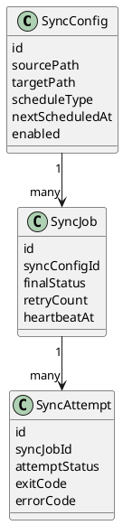
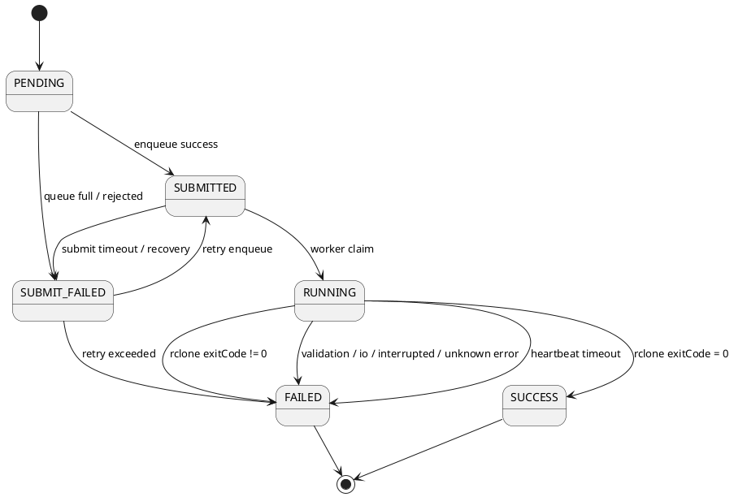
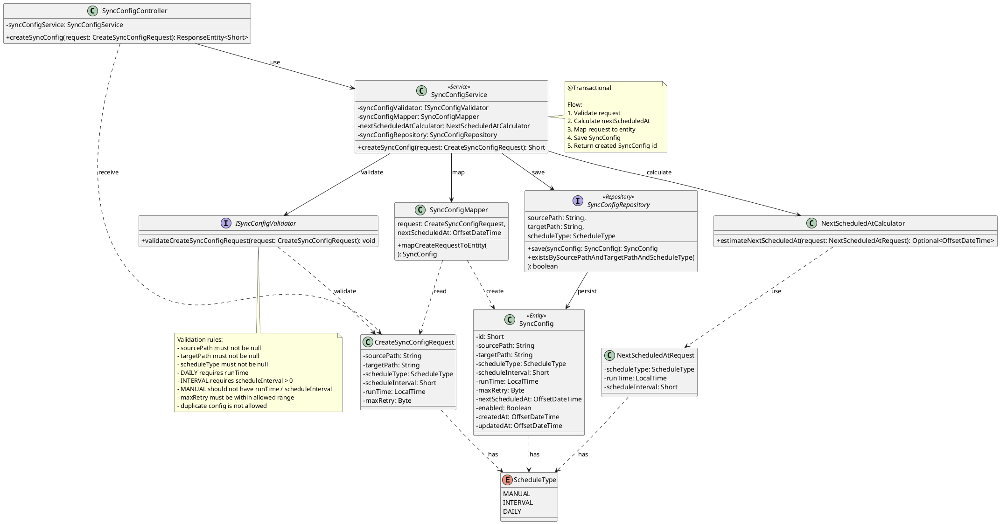
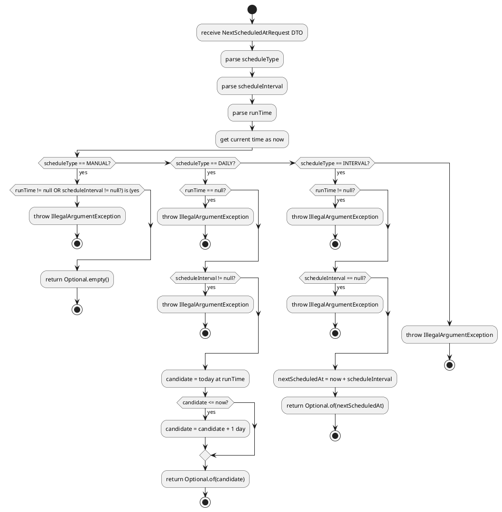
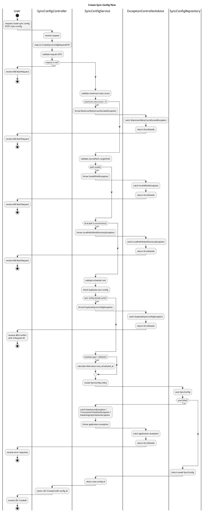
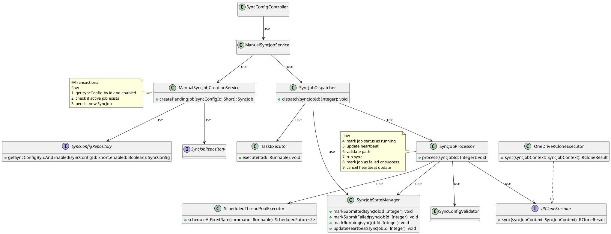
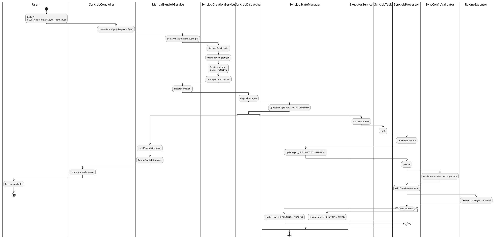
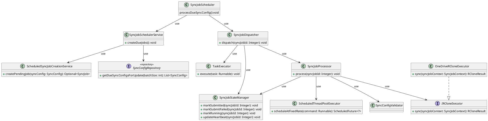
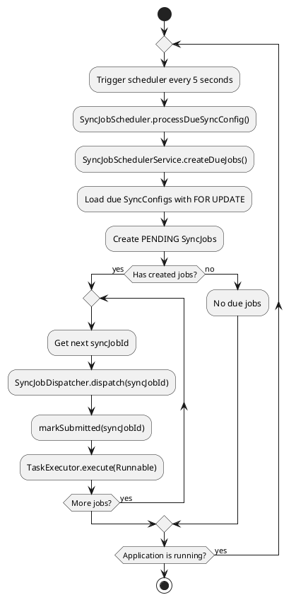

## 1 Overview
- Hệ thống Personal Cloud sync giúp đồng bộ file local lên cloud bằng công ty `rclone`
- Mục tiêu chính:
  - Tạo cấu hình đồng bộ lâu dài vào `sync_config`.
  - Chạy đồng bộ thủ công hoặc theo lịch.
  - Mỗi lần đồng bộ được biểu diễn bằng một `sync_job`.
  - Ghi nhận kết quả thực thi, lỗi, exit code và log xử lý vào `sync_attempt`.
  - Có hỗ trợ recovery với các `sync_job` bị kẹt và có observability trên prometheus.
  - Hỗ trợ retry ở phase sau.
## 2 Scope / Non-scope
### 2.1 Scope
- Tạo `sync config`.
- Chạy `sync job` thủ công.
- Tạo `sync job` định kỳ theo schedule đọc được từ `sync_config`.
- Dispatch job sang worker.
- Theo dõi trạng thái job.
- Recovery job bị kẹt.
### 2.2 Non-scope
- Không tự implement cloud storage , dùng cloud storage bên thứ 3 hỗ trợ như `OneDrive`.
- Không mã hóa file.
- Không hỗ trợ multi-user ,và  trên 1 scheduler ở phiên bản đầu.
- Chưa có API hỗ trợ cho việc update sync config
## 3 Core Requirements
- Một sync config không được có nhiều active job cùng lúc. active job là những job có trạng thái PENDING, SUBMITTED, RUNNING,
- Job phải có state rõ ràng: PENDING, SUBMITTED,SUBMIT_FAILED RUNNING, SUCCESS, FAILED.
- Scheduler không được tạo duplicate job khi chạy đồng thời.
- Job RUNNING quá lâu phải được recovery. Thời gian sẽ được đo theo heartbeat. Cứ 5 s một lần nếu job đang running sẽ cập nhật vào db. Để xác định xem job còn sống ko.
- Mọi trạng thái quan trọng phải có log và metric.
## 4 Domain Model
### 4.1 Entity Relationship



#### 4.1.1 Sync Config
`sync_config` đại diện cho một cấu hình đồng bộ lâu dài. Mặc định nếu không truyền khi gọi API tạo thì sẽ lưu ScheduleType là MANUAL. Và mặc định enabled là true

Các thông tin chính của sync config
``` text
id
enabled
createdAt
updatedAt
nextScheduledAt
sourcePath
targetPath

```

Ví dụ:

```text
sourcePath = /home/user/data
targetPath = /mnt/onedrive/backup
scheduleType = MANUAL
enabled = true
```

Một `sync_config` có thể sinh ra nhiều `sync_job`.

Ví dụ:

```text
sync_config #1
├── sync_job #101 MANUAL FAILED
├── sync_job #102 MANUAL SUCCESS
└── sync_job #103 SCHEDULED SUCCESS
```

#### 4.1.2 Sync Job

`sync_job` đại diện cho một lần chạy cụ thể của một `sync_config`.

Một job có thể được tạo bởi:

- User gọi API chạy thủ công.
- Scheduler tạo job theo lịch.

Các thông tin chính của `sync_job`:

```text
id
finalStatus
createdAt
submittedAt
startedAt
heartbeatAt
submitFailedAt
finishedAt
```

#### 4.1.3 Sync Attempt

`sync_attempt` đại diện cho một lần thực thi thực tế của job.

Nếu job có retry, một `sync_job` có thể có nhiều `sync_attempt`.

Ví dụ:

```text
sync_job #100
├── sync_attempt #103 FAILED RCLONE_ERROR
└── sync_attempt #104 SUCCESS
```

Trong Phase 1, nếu chưa triển khai retry đầy đủ, có thể coi mỗi `sync_job` có tối đa một `sync_attempt`.

---


### 4.2 State Machine
#### 4.2.1 Job Status

```text
PENDING
SUBMITTED
SUBMIT_FAILED
RUNNING
SUCCESS
FAILED
```

Ý nghĩa:

| Status        | Meaning                                                       |
| ------------- | ------------------------------------------------------------- |
| PENDING       | Job đã được tạo trong DB nhưng chưa submit vào executor/queue |
| SUBMITTED     | Job đã được submit vào executor/queue                         |
| SUBMIT_FAILED | Submit thất bại, ví dụ queue full hoặc executor reject        |
| RUNNING       | Worker đã claim job và đang chạy rclone                       |
| SUCCESS       | Job hoàn thành thành công                                     |
| FAILED        | Job thất bại và không còn được xử lý tiếp                     |
#### 4.2.2 State Transition


## 5 Feature: Create Sync Config
### 5.1 Responsibility
- Cho phép user tạo Cấu hình Sync Config để chạy lâu dài.
### 5.2 API / Entry Point

#### 5.2.1 API Endpoints
```http
POST /sync-config/
```

#### 5.2.2 Request

```json
{
  "sourcePath": "/home/user/data",
  "targetPath": "/mnt/backup/data",
  "scheduleType": "MANUAL",
  "enabled": true,
  "scheduleInterval": null,
  "runTime": null
}
```

#### 5.2.3 Response - 201 Created

```json
{
  "id": 1
}
```

#### 5.2.4 Error Cases

##### 5.2.4.1 Sync config already exists

```http
400 Bad Request
```

```json
{
  "message": "Sync config already exists"
}
```

##### 5.2.4.2 Path is blank

```http
400 Bad Request
```

```json
{
  "message": "Source path or target path should not be blank"
}
```

##### 5.2.4.3 Path is invalid

```http
400 Bad Request
```

```json
{
  "message": "Source path or target path is invalid"
}
```

---
### 5.3 Class Diagram



- Flow tính giá trị của `nextScheduledAt`


### 5.4 Sequence Flow



### 5.5 Validation Rules
#### 5.5.1 Path Validation
- Source hay target path không được null
- Source path hay target path không được trống
- Source path phải tồn tại trên máy
- Path phải là absolute Linux path.
  Supported:

```text
/home/user/data
/mnt/backup
```
Not supported:

```text
~/data
./data
../data
```

#### 5.5.2 Unique Sync Config

Không cho phép tạo trùng `sync_config` có cùng:

```text
sourcePath
targetPath
scheduleType
```

Database constraint:

```text
unique(source_path, target_path, schedule_type)
```

Nếu đã tồn tại sync config tương ứng, hệ thống trả về `400 Bad Request`.

#### 5.5.3 Schedule Type Rule

##### 5.5.3.1 MANUAL

```text
scheduleType = MANUAL
scheduleInterval = null
runTime = null
nextScheduledAt = null
```

##### 5.5.3.2 INTERVAL

```text
scheduleType = INTERVAL
scheduleInterval must not be null
scheduleInterval > 0
runTime = null
nextScheduledAt must not be null
```

##### 5.5.3.3 DAILY

```text
scheduleType = DAILY
runTime must not be null
scheduleInterval = null
nextScheduledAt must not be null
```

---

### 5.6 Transaction Boundary

Transaction chỉ bao quanh gồm:
- kiểm tra request;
- map request sang entity;
- Lưu xuống db;

Lý do: transaction boundary nằm ở Service, dễ mở rộng về sau. Lý do là transaction thuộc về **business use case**, không thuộc về thao tác CRUD.
> The `@Transactional` annotation belongs to the Service layer because it is the Service layer’s responsibility to define the transaction boundaries. [reference](https://vladmihalcea.com/spring-transactional-annotation/)
### 5.7 DB Constraints / Index
#### 5.7.1 Unique Constraints

```mysql
primary(id)
unique(source_path, target_path, schedule_type)
```

Không cần đánh index thứ 2 vì tính năng này chỉ có insert giá trị mới .


### 5.8 Error Handling

| Case                           | HTTP Status | Exception                        |
| ------------------------------ | ----------: | -------------------------------- |
| Request body is null           |         400 |                                  |
| Path does not exist            |         400 | InvalidPathException             |
| Path is not directory          |         400 | LocalPathIsNotDirectoryException |
| Source path / target path null |         400 | InvalidPathException             |
| maximum retry count > 5        |         400 | MaximumRetryCountExceedException |
| Create same config             |         400 | DuplicateSyncConfigException     |
| DB not avaiable                |         500 | InternalServerException          |

## 6 Feature: Create and Run Manual Sync Job
### 6.1 Responsibility
- Cho phép user tạo sync job thủ công từ một sync config  với Schedule Type là MANUAL có sẵn.
### 6.2 API / Entry Point
#### 6.2.1 API Endpoints
```HTTP
POST /sync-config/{id}/sync-jobs/manual


```
### 6.3 Class Diagram


### 6.4 Sequence Flow



### 6.5 Validation Rules
- Việc kiểm tra cấu hình path đã được tiến hành ở bước tạo Sync Config nên tạm bỏ qua ở flow này.
### 6.6 Transaction Boundary

#### 6.6.1 Create Pending Job
```java
@Transactional  
public SyncJob createPendingJob(Short syncConfigId) {  
    SyncConfig syncConfig = syncConfigRepository.getSyncConfigByIdAndEnabled(syncConfigId, Boolean.TRUE).orElseThrow(SyncConfigNotFoundException::new);  
  
    if (syncJobRepository.existsBySyncConfigIdAndFinalStatusIn(syncConfigId, List.of(JobStatus.PENDING, JobStatus.RUNNING, JobStatus.SUBMITTED))) {  
        throw new SyncJobAlreadyActiveException();  
    }  
  
    SyncJob syncJob = new SyncJob();  
    syncJob.setSyncConfig(syncConfig);  
    syncJob.setFinalStatus(JobStatus.PENDING);  
  
    return syncJobRepository.save(syncJob);  
}
```
Transaction boundary bao trùm toàn bộ flow tạo job:

- Lock và load `SyncConfig` đang enabled.
- Kiểm tra xem `SyncConfig` đó đã có active job chưa.
- Nếu chưa có active job thì tạo `SyncJob` mới với trạng thái `PENDING`.
- Persist `SyncJob` xuống bảng `sync_job`.

Điểm quan trọng: thao tác **check active job** và **insert new pending job** phải nằm trong cùng một transaction. Nếu tách ra, hai request đồng thời có thể cùng thấy “chưa có active job” rồi cùng tạo job mới.

#### 6.6.2 process scheduled jobs

Không đặt `@Transactional` trực tiếp trên hàm `process()`.

Lý do: `process()` có gọi external process thông qua `rcloneExecutor.sync()`. Quá trình này có thể chạy lâu. Nếu đặt transaction boundary bao quanh toàn bộ `process()`, database connection sẽ bị giữ trong suốt thời gian external process chạy.

Vì vậy transaction boundary được thiết kế ngắn và đặt trong các method nhỏ chuyên xử lý state transition:

- `markRunning()`
- `updateHeartbeat()`
- `markSuccess()`
- `markFailed()`

Mỗi method tự mở transaction riêng, cập nhật trạng thái job, sau đó commit ngay.

``` java

public void process(Integer syncJobId) {
        log.info("SYNC_JOB_PROCESS_STARTED");
        SyncJobContext syncJobContext = SyncJobStateManager.markRunning(syncJobId);
        ScheduledFuture<?> heartbeatTask = heartbeatExecutor.scheduleAtFixedRate(
                () -> {
                    try {
                        SyncJobStateManager.updateHeartbeat(syncJobId);
                    } catch (Exception e) {
                        log.warn("UPDATE_HEARTBEAT_FAILED syncJobId={}", syncJobId, e);
                    }
                },
                5,
                5,
                TimeUnit.SECONDS
        );
        try {
            validate(syncJobContext);
            RCloneResult rCloneResult = rCloneExecutor.sync(syncJobContext);
            log.info("RCLONE_FINISHED exitCode={} errorMessage={}",
                    rCloneResult.getExitCode(), rCloneResult.getErrorMessage());
            if (rCloneResult.isSuccess()) {
                SyncJobStateManager.markSuccess(syncJobContext);
            } else {
                SyncErrorLog syncErrorLog = new SyncErrorLog(SyncErrorCode.SYNC_PROCESS_ERROR, "Rclone process finished with non-zero exit code");
                SyncJobStateManager.markFailed(syncJobContext, syncErrorLog);
            }
        } catch (IOException e) {
            SyncErrorLog syncErrorLog = new SyncErrorLog(SyncErrorCode.IO_ERROR, "IOException occurred while starting process or reading process output");
            SyncJobStateManager.markFailed(syncJobContext, syncErrorLog);
        } catch (InterruptedException e) {
            Thread.currentThread().interrupt();
            SyncErrorLog syncErrorLog = new SyncErrorLog(SyncErrorCode.INTERRUPTED, "Worker thread was interrupted while waiting for sync process");
            SyncJobStateManager.markFailed(syncJobContext, syncErrorLog);
        } catch (InvalidPathException | LocalPathIsNotDirectory e) {
            SyncErrorLog syncErrorLog = new SyncErrorLog(SyncErrorCode.VALIDATION_ERROR, "Source path / target path invalid before running sync job");
            SyncJobStateManager.markFailed(syncJobContext, syncErrorLog);
        } catch (Exception e) {
            SyncErrorLog syncErrorLog = new SyncErrorLog(SyncErrorCode.UNKNOWN_ERROR, e.getMessage());
k            SyncJobStateManager.markFailed(syncJobContext, syncErrorLog);
        } finally {
            heartbeatTask.cancel(true);
        }
    }
```
### 6.7 Concurrency Control / Locking
Khi tạo `SyncJob`, hệ thống dùng **pessimistic lock trên row `SyncConfig`** tương ứng.

Lý do không lock trực tiếp trên `SyncJob` là tại thời điểm bắt đầu flow, `SyncJob` mới chưa tồn tại. Vì vậy `SyncConfig` được dùng như **coordination lock** cho toàn bộ quá trình tạo job.

Flow concurrency:
1. Request A lock được `SyncConfig`.
2. Request B muốn tạo job cho cùng `SyncConfig` sẽ phải chờ.
3. Request A kiểm tra active job, tạo `PENDING` job và commit.
4. Request B tiếp tục chạy sau khi A commit, kiểm tra lại active job và thấy job vừa được tạo.
5. Request B throw `SyncJobAlreadyActiveException`.
### 6.8 Query

- Tìm sync config theo id và enabled là true:

```sql

SELECT sc1_0.id,  
       sc1_0.created_at,  
       sc1_0.enabled,  
       sc1_0.max_retry,  
       sc1_0.next_scheduled_at,  
       sc1_0.run_time,  
       sc1_0.sync_interval,  
       sc1_0.schedule_type,  
       sc1_0.source_path,  
       sc1_0.target_path,  
       sc1_0.updated_at  
FROM sync_config sc1_0  
WHERE sc1_0.id = ?  
  AND sc1_0.enabled = ? FOR  
UPDATE OF sc1_0
```

- Kiểm tra xem active job đã được tạo chưa :
```sql
SELECT CASE WHEN COUNT(sj1_0.id) > 0 THEN TRUE ELSE FALSE END  
FROM personal_sync_db.sync_job sj1_0  
WHERE sj1_0.sync_config_id = 17  
  AND sj1_0.final_status IN ('PENDING', 'RUNNING','SUBMITTED');

```
- chuyển trạng thái từ PENDING -> SUBMITTED
```sql
UPDATE personal_sync_db.sync_job sj  
SET sj.final_status = 'SUBMITTED',  
    sj.submitted_at = NOW()  
WHERE sj.id = 17  
  AND sj.final_status = 'PENDING';
```
### 6.9 DB Constraints / Index

``` sql 

CREATE INDEX idx_sync_config_status
    ON sync_job (sync_config_id, final_status);
```
> trade-off: "Thêm index để tối ưu việc tìm  active job , đổi lại INSERT phải cập nhật thêm một index."
### 6.10 Error Handling

| Case                                                     |   HTTP Status | Exception                     |
| -------------------------------------------------------- | ------------: | ----------------------------- |
| Sync Config not found!                                   | 404 Not Found | SyncConfigNotFoundException   |
| Sync config already has pending/running or submitted job |  409 Conflict | SyncJobAlreadyActiveException |
## 7 Feature: Create and Run Scheduled Sync Jobs
### 7.1 Responsibility
-  Tạo `sync job` định kỳ theo schedule đọc được từ `sync_config`.
### 7.2 API / Entry Point
- Không hỗ trợ API Endpoint
### 7.3 Class Diagram

### 7.4 Sequence Flow



### 7.5 Transaction Boundary

#### 7.5.1 Create Due Jobs
- Transaction boundary được đặt tại `SyncJobSchedulerService#createDueJobs()`.
- Khi lấy các `SyncConfig` tới hạn bằng `PESSIMISTIC_WRITE`, transaction sẽ giữ lock trên các row `SyncConfig` đó cho đến khi `createDueJobs()` kết thúc và transaction được `commit` hoặc `rollback`.
- Vì lock được giữ trong suốt quá trình xử lý batch, `batchSize` cần được cấu hình hợp lý. Nếu batch quá lớn, transaction sẽ kéo dài, làm tăng thời gian giữ lock và có thể ảnh hưởng đến scheduler instance khác.
- Với từng `SyncConfig`, hệ thống cố gắng tạo một `SyncJob` ở trạng thái `PENDING`.
- Nếu `SyncConfig` đã có job đang active như `PENDING`, `RUNNING` hoặc `SUBMITTED`, hàm `ScheduledSyncJobCreationService#createPendingJob()` sẽ trả về `Optional.empty()` thay vì ném `RuntimeException`.
- Do đó, một `SyncConfig` không tạo được job sẽ không làm rollback toàn bộ batch. Scheduler chỉ bỏ qua config đó và tiếp tục xử lý các config còn lại.
- `ScheduledSyncJobCreationService#createPendingJob()` đang dùng propagation mặc định `REQUIRED`, nên nó tham gia vào transaction hiện tại của `SyncJobSchedulerService#createDueJobs()`, không mở transaction riêng.

```java
# SyncJobSchedulerService.java

@Transactional  
@Timed( /*...*/)  
public List<Integer> createDueJobs() {  
    List<Integer> syncJobs = new ArrayList<>();  
    int batchSize = syncJobSchedulerProperties.getBatchSize();  
  
    List<SyncConfig> syncConfigs = getDueSyncConfigsForUpdate(batchSize);  
  
    for (SyncConfig syncConfig : syncConfigs) {  
        Optional<SyncJob> syncJob = scheduledSyncJobCreationService.createPendingJob(syncConfig);  
        syncJob.ifPresent(job -> syncJobs.add(job.getId()));  
        syncConfig.setNextScheduledAt(estimateNextScheduledAt(syncConfig));  
    }  
  
    return syncJobs;  
}

# ScheduledSyncJobCreationService.java
@Transactional  
public Optional<SyncJob> createPendingJob(SyncConfig syncConfig) {  
  
    if (syncJobRepository.existsBySyncConfigIdAndFinalStatusIn(syncConfig.getId(), List.of(JobStatus.PENDING, JobStatus.RUNNING, JobStatus.SUBMITTED))) {  
        log.info("ACTIVE_JOB_ALREADY_EXISTS_OR_STUCK syncConfigId={}",syncConfig.getId());  
        return Optional.empty();  
    }  
  
    SyncJob syncJob = new SyncJob();  
    syncJob.setSyncConfig(syncConfig);  
    syncJob.setFinalStatus(JobStatus.PENDING);  
  
    return Optional.of(syncJobRepository.save(syncJob));  
}

# SyncJobSchedulerService.java 
private List<SyncConfig> getDueSyncConfigsForUpdate(int batchSize) {  
    return syncConfigRepository.findDueNonManualScheduleTypeSyncConfigs(  
            ScheduleType.MANUAL,  
            OffsetDateTime.now(systemClock),  
            PageRequest.of(  
                    0,  
                    batchSize,  
                    Sort.by("nextScheduledAt").ascending()  
            )  
    );  
}

# SyncConfigRepository.java
@Lock(LockModeType.PESSIMISTIC_WRITE)  
@Query("""  
        select sc        from SyncConfig sc        where sc.enabled = true          and sc.scheduleType <> :scheduleType          and sc.nextScheduledAt <= :now        """)  
List<SyncConfig> findDueNonManualScheduleTypeSyncConfigs(  
        @Param("scheduleType") ScheduleType scheduleType,  
        @Param("now") OffsetDateTime now,  
        Pageable pageable  
);
```
### 7.6 Concurrency Control / Locking
- Khi lấy các `SyncConfig` tới hạn bằng `PESSIMISTIC_WRITE`, transaction sẽ giữ lock trên các row `SyncConfig` đó cho đến khi `createDueJobs()` kết thúc và transaction được `commit` hoặc `rollback`.
- Vì lock được giữ trong suốt quá trình xử lý batch, `batchSize` cần được cấu hình hợp lý. Nếu batch quá lớn, transaction sẽ kéo dài, làm tăng thời gian giữ lock và có thể ảnh hưởng đến scheduler instance khác.
### 7.7 DB Constraints / Index
-  Index đúng là được sử dụng khi đổi sang `IN (...)`, nhưng `sync_config` chỉ là bảng cấu hình, dự kiến rất nhỏ. Nên ưu tiên giữ query phản ánh đúng business và tránh tối ưu sớm. Khi dữ liệu tăng hoặc execution plan trở thành bottleneck,  sẽ bổ sung index.
### 7.8 Query
#### 7.8.1 find Due Non-Manual Schedule Type Sync Configs

```sql
SELECT sc1_0.id,  
       sc1_0.created_at,  
       sc1_0.enabled,  
       sc1_0.max_retry,  
       sc1_0.next_scheduled_at,  
       sc1_0.run_time,  
       sc1_0.sync_interval,  
       sc1_0.schedule_type,  
       sc1_0.source_path,  
       sc1_0.target_path,  
       sc1_0.updated_at  
FROM sync_config sc1_0  
WHERE sc1_0.enabled = TRUE  
  AND sc1_0.schedule_type <> 'MANUAL'  
  AND sc1_0.next_scheduled_at <= NOW()  
ORDER BY sc1_0.next_scheduled_at  
LIMIT 10  
FOR  
UPDATE OF sc1_0
```
Scheduler sẽ được chạy cho các sync config với schedule type khác  **MANUAL**.

Lý do:
- Scheduler chỉ cần loại bỏ `MANUAL`.
- Sau này nếu thêm `WEEKLY`, `MONTHLY`, `CRON`..., query không cần sửa.
- Phù hợp với Open/Closed Principle hơn vì repository không phải thay đổi khi thêm một loại schedule mới.
### 7.9 Trade off
Mặc dù thử nghiệm cho thấy sử dụng `schedule_type IN ('DAILY', 'INTERVAL')` kết hợp composite index giúp MySQL chọn `Index Range Scan`, nhưng dự án hiện tại quyết định **không tạo composite index** vì các lý do sau:

- Bảng `sync_config` chỉ lưu cấu hình đồng bộ, số lượng bản ghi dự kiến rất nhỏ (vài chục đến vài trăm bản ghi).
- Với quy mô dữ liệu này, `Full Table Scan` có chi phí rất thấp và không tạo ra bottleneck đáng kể.
- Giữ query `schedule_type <> 'MANUAL'` phản ánh đúng business rule: scheduler xử lý tất cả các loại schedule tự động, chỉ loại trừ `MANUAL`.
- Tránh tối ưu sớm (premature optimization). Nếu sau này số lượng `SyncConfig` tăng đáng kể hoặc `EXPLAIN ANALYZE` cho thấy scheduler trở thành bottleneck, sẽ xem xét bổ sung composite index phù hợp.

## 8 Feature: Recovery Scheduler

### 8.1 Responsibility
-  
### 8.2 API / Entry Point
### 8.3 Class Diagram
### 8.4 Sequence Flow
### 8.5 Validation Rules
### 8.6 Transaction Boundary
### 8.7 Concurrency Control / Locking
### 8.8 DB Constraints / Index
### 8.9 Query
### 8.10 Error Handling
### 8.11 Test Cases